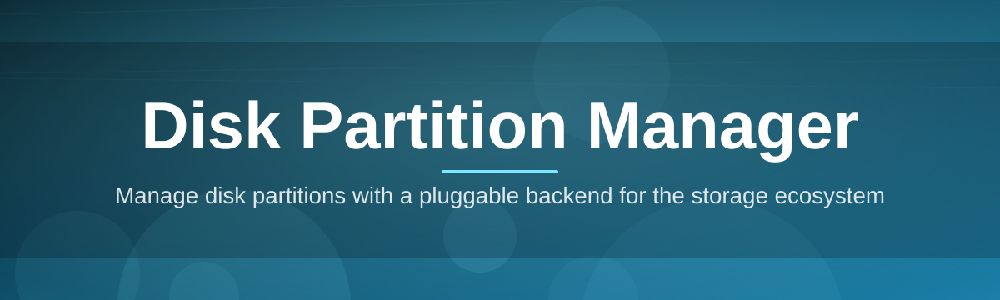
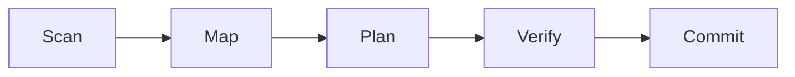

# dp-manager 💾🧩

  

*Reshape, resize, and reorganize your disks without ever losing a byte of sleep.*

  

---

## 🚀 Quick Start

> [!TIP]
> This is all most people need. Everything else in this README is context, reference, and reassurance.

1. **Visit the landing page** and grab the latest build — click the download button below.

2. **Run the executable** — no installer wizard, no bundled toolbars, just `dp-manager.exe`.

3. **Select a disk, pick an action** (resize, create, merge, format) and confirm — dp-manager handles the rest.

---

## 🧭 Overview

**dp-manager** is a standalone Windows utility built for one purpose: giving you clear, direct control over how your disks are carved up. Partitioning has always been one of those tasks that sits at the intersection of "critical" and "terrifying" — one wrong move and an entire volume can vanish. dp-manager exists to remove that anxiety by wrapping low-level disk partition operations in an interface that shows you exactly what will happen before it happens.

Whether you're a system administrator provisioning dozens of workstations, a developer juggling dual-boot environments, or a home user finally splitting that oversized single-partition drive, dp-manager is built for you. It supports the full lifecycle of partition management — creating, deleting, resizing, formatting, and relabeling — across both MBR and GPT disk layouts, without requiring you to touch a command line unless you want to.

Unlike bloated all-in-one "disk suites," dp-manager stays focused. It doesn't try to be a backup tool, a registry cleaner, or a system optimizer. It does disk partition management, and it does it with the kind of precision that makes storage professionals comfortable trusting it on production machines. Every operation is previewed, every risky action is flagged, and nothing writes to disk until you explicitly say so.

---

## 🛠️ What It Actually Does

- **Non-destructive resizing** — grow or shrink NTFS, FAT32, and exFAT partitions while the volume's contents remain untouched, using cluster-aware boundary calculations instead of blind byte-shifting.

- **Live disk map** — a scaled, color-coded visual of every partition on every attached disk, updated in real time as you make changes, so you always know what you're about to commit.

- **Merge & split operations** — combine adjacent partitions into one contiguous volume, or split a single partition into two without a full reformat cycle.

- **MBR ↔ GPT conversion** — migrate legacy Master Boot Record disks to GUID Partition Table structure (and back) when disk size or boot requirements demand it.

- **Batch queueing** — stack multiple partition operations into a single queue, review the entire plan, then execute it as one atomic sequence.

- **Drive letter & label management** — reassign letters, rename volumes, and manage mount points without diving into disk management consoles.

- **Bootable rescue mode** — launch dp-manager from a standalone boot environment to repartition a system drive that Windows itself can't touch.

- **Operation logging** — every action is timestamped and recorded locally, giving you an audit trail for compliance or simple peace of mind.

> [!NOTE]
> dp-manager calculates a full rollback plan before every operation. If a resize or move is interrupted mid-way, the tool can revert cluster tables to their pre-operation state on next launch.

---

## 📥 How to Get Started

1. Head to the **project landing page** using the download button above.

2. Download the standalone `dp-manager.exe` — no bundled installer, no background services.

3. Launch it directly (right-click → *Run as administrator* is recommended for full disk access).

4. Choose your target disk from the left panel, review the live disk map, and queue your first operation.

> [!IMPORTANT]
> Administrator privileges are required for any operation that modifies partition tables. Read-only inspection works without elevation.

---

## 💻 System Requirements

| Component | Minimum | Recommended |
|---|---|---|
| OS | Windows 10 (64-bit) | Windows 11 (64-bit) |
| RAM | 2 GB | 4 GB+ |
| Disk space | 40 MB free | 100 MB free |
| Dependencies | None | None |
| Privileges | Standard (read-only mode) | Administrator (full mode) |

  

dp-manager ships as a single portable executable. Nothing is installed to the registry, no background services are registered, and no dependencies are required beyond the operating system itself.

---

## ⚙️ How It Works

Under the hood, dp-manager follows a deliberately conservative pipeline — every disk partition operation passes through the same verification gate before touching a single sector.

1. **Scan** — dp-manager enumerates all connected physical disks and reads their partition tables directly.

2. **Map** — the raw table data is translated into the visual disk map you interact with.

3. **Plan** — your requested action (resize, merge, split, format) is converted into a discrete operation plan with a computed rollback state.

4. **Verify** — the plan is checked against filesystem boundaries, cluster alignment, and free space to catch conflicts before execution.

5. **Commit** — only after verification passes does dp-manager write changes to disk, logging each step as it goes.

> [!WARNING]
> Interrupting power or forcibly closing dp-manager during the Commit stage on a system drive can leave a partition in an inconsistent state. Always let a commit finish, and keep a backup of critical data regardless of how careful the tool is.

---

## 🩹 Troubleshooting

<strong>dp-manager says "Access Denied" when I try to resize a partition.</strong>

You're not running with administrator privileges. Right-click the executable and select *Run as administrator* — partition table writes require elevated access on Windows.

<strong>My USB drive doesn't appear in the disk list.</strong>

Some external enclosures report themselves as "removable media" in a way Windows hides from raw disk enumeration. Try reconnecting the drive, or check Device Manager to confirm it's recognized at the OS level first.

<strong>A resize operation is stuck at "Verifying."</strong>

Large NTFS volumes with heavy fragmentation can take longer to validate cluster boundaries. Let it run — forcibly closing during verification is safe, but doing so during Commit is not.

<strong>Can I resize the partition Windows is currently running from?</strong>

Yes, using **Bootable rescue mode**, which loads dp-manager outside the active Windows environment so the system partition isn't locked.

<strong>I converted a disk from MBR to GPT and now it won't boot.</strong>

MBR-to-GPT conversion changes boot requirements — you may need to switch your firmware from Legacy/CSM boot to UEFI boot mode in your motherboard settings after conversion.

<strong>Does dp-manager support dynamic disks?</strong>

Dynamic disk support is limited to read-only inspection in the current release. Full dynamic disk operations are on the roadmap.

---

## 🎨 UI / UX Details

dp-manager's interface is built around the disk map — everything else orbits it.

- **Themes** — Light, Dark, and a high-contrast "Slate" mode for low-light environments, switchable from the settings gear icon.

- **Keyboard shortcuts:**

| Shortcut | Action |
|---|---|
| `Ctrl + N` | Create new partition |
| `Ctrl + R` | Resize selected partition |
| `Ctrl + D` | Delete selected partition |
| `Ctrl + Q` | Open operation queue |
| `Ctrl + Z` | Undo last queued (uncommitted) action |
| `F5` | Rescan all disks |

- **Settings persistence** — window layout, theme, and default units (MB/GB) are saved to a local config file, no cloud sync involved.

- **Disk map interactions** — drag partition edges to resize visually, or right-click for a full context menu of available operations.

> [!TIP]
> Enable "Confirm every commit" in Settings → Safety if you want an extra prompt before any write operation, even ones already reviewed in the queue.

---

## 🤝 Contributing & Community

dp-manager grew from contributions by systems administrators, hobbyist tinkerers, and storage engineers who wanted a partition manager that respects their time and their data.

- Found a bug? Open an issue with your disk layout details (sanitized) and steps to reproduce.

- Have an idea for a feature? Start a discussion thread before opening a pull request — architectural changes benefit from early feedback.

- Documentation improvements, translations, and UI polish are always welcome.

> [!NOTE]
> Pull requests touching the core partition-write engine require additional review time given the sensitivity of the operations involved. Thank you for your patience — reliability matters more than speed here.

---

## 📄 License

Released under the [MIT License](LICENSE), 2026.

---

## ⚠️ Disclaimer

> Partition management is inherently a data-sensitive operation. While dp-manager is engineered with verification and rollback safeguards at every stage, no software can guarantee against hardware failure, power loss, or unforeseen edge cases. **Always maintain a current backup of important data before performing any disk partition operation.** The maintainers of dp-manager are not liable for data loss resulting from use or misuse of this tool.

---

## 📋 Changelog

### v2026.2 — "Steady Hand"
- Added Bootable rescue mode for system-drive repartitioning.
- Improved cluster-alignment verification for large NTFS volumes.
- Fixed an issue where drive letters could be duplicated after a merge operation.

### v2026.1 — "Clear Map"
- Introduced the live, color-coded disk map replacing the legacy table view.
- Added batch queueing for stacked operations.
- Performance improvements when scanning disks with more than 12 partitions.

### v2026.0 — "Foundation"
- Initial public release.
- Core resize, create, delete, merge, and split operations.
- MBR ↔ GPT conversion support.

---

